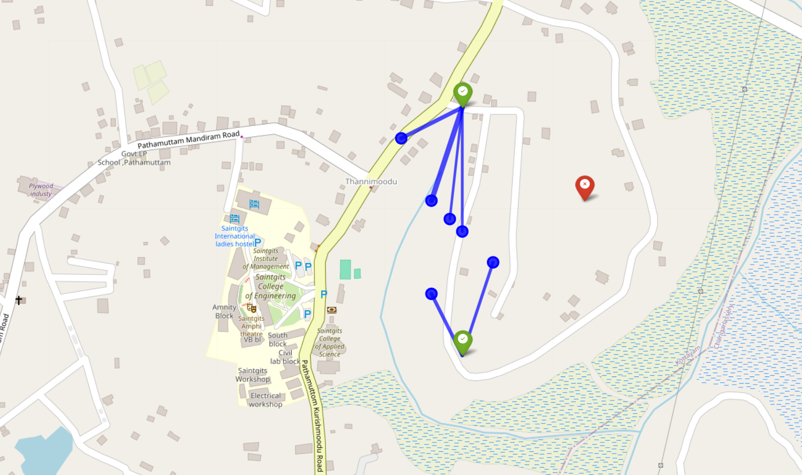
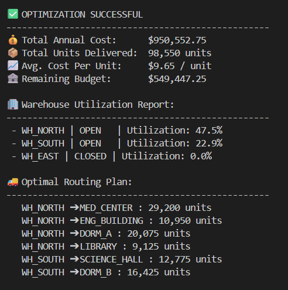

**Course:** 24MAT382 - Computational Optimization and Applications  
**Institution:** Saintgits College of Engineering (Autonomous)  

---

## Abstract
The efficiency of logistics systems within large institutional campuses is often compromised by ad-hoc planning and the absence of systematic optimization techniques. This study presents a computational framework for optimizing an emergency supply distribution network for Campus City Logistics. The problem is formulated as a Mixed-Integer Linear Programming (MILP) model that simultaneously determines optimal warehouse selection and distribution routing for six critical campus facilities. To enhance realism, geographic coordinates of warehouses and demand nodes are incorporated, and transportation costs are dynamically computed using the Haversine formula to represent true physical distances. The optimization model is implemented in Python using the libraries pandas and pulp. The resulting solution identifies a globally optimal dual-warehouse configuration that satisfies all demand requirements while maintaining redundancy within the distribution network. The optimized configuration achieves complete demand coverage with an annual operational cost of $950,552.75, remaining significantly below the allocated budget ceiling of $1.5 million. The results demonstrate the effectiveness of computational optimization techniques for improving logistics efficiency in institutional environments.

**Keywords:** Mixed-Integer Linear Programming, Supply Chain Optimization, Python, Haversine Formula, Geographic Information Systems, Logistics.

## Introduction
Institutional logistics networks frequently suffer from inefficiencies arising from decentralized decision making and the absence of mathematically grounded planning methods. When distribution systems are designed without optimization frameworks, transportation routes may become unnecessarily long, storage capacities may be misallocated, and operational costs can increase significantly. These inefficiencies are particularly problematic in environments such as large university campuses where multiple facilities depend on reliable and timely supply distribution.

The objective of this study is to design a cost-efficient and reliable campus logistics network through computational optimization techniques. The proposed system must distribute a total of 270 units of supplies per day across six essential campus facilities including the Medical Center, Engineering Building, Science Hall, North Dormitory, South Dormitory, and Main Library.

To maintain operational resilience, the network design incorporates redundancy constraints that prevent reliance on a single distribution node. Exactly two warehouses must therefore be selected from three candidate locations situated in the North, South, and East regions of the campus. Each warehouse has a defined capacity limitation and associated operational cost. The optimization model must determine which warehouses should be activated and how supply flows should be allocated so that all demand requirements are satisfied while minimizing total operational cost.

The cost structure of the system incorporates amortized warehouse construction costs, daily operational costs, and transportation costs derived from geographic distance. In addition, the entire system must operate within a strict annual budget constraint of $1,500,000.

## Notation
The optimization model uses the following notation to represent warehouses, campus facilities, costs, and decision variables.

| Symbol     | Description                                                            |
| ---------- | ---------------------------------------------------------------------- |
| $I$        | Set of candidate warehouse locations                                   |
| $J$        | Set of campus facilities requiring supply                              |
| $D_j$      | Daily demand of facility $j$ (units per day)                           |
| $C_i$      | Maximum daily capacity of warehouse $i$                                |
| $F_i$      | Construction cost of warehouse $i$                                     |
| $O_i$      | Daily operational cost of warehouse $i$                                |
| $T_{ij}$   | Transportation cost per unit from warehouse $i$ to facility $j$        |
| $y_i$      | Binary decision variable indicating whether warehouse $i$ is activated |
| $X_{ij}$   | Annual quantity of units shipped from warehouse $i$ to facility $j$    |
| $Z$        | Total annual logistics cost                                            |


## Mathematical Formulation
The campus logistics scenario is modeled using a Mixed-Integer Linear Programming framework. This approach enables the model to simultaneously represent discrete decisions, such as warehouse selection, and continuous decisions, such as shipment quantities. 

Let the set $I$ represent the candidate warehouses consisting of the North, South, and East locations. The set $J$ represents the six campus facilities that require daily supply distribution. Each facility $j$ has a daily demand $D_j$, while each warehouse $i$ has a maximum daily capacity $C_i$. Warehouse construction costs are represented by $F_i$, daily operating costs by $O_i$, and transportation costs between warehouse $i$ and facility $j$ by $T_{ij}$.

The binary decision variable $y_i$ represents whether warehouse $i$ is activated, while the continuous variable $X_{ij}$ represents the annual number of supply units transported from warehouse $i$ to facility $j$.

### Objective Function
Minimize the total annual cost:
$$\text{Minimize } Z = \sum_{i \in I} \left(\frac{F_i}{10} + 365O_i\right) y_i + \sum_{i \in I}\sum_{j \in J} T_{ij}X_{ij}$$

### Constraints
**Redundancy Constraint:** Ensures exactly two warehouses are selected.
$$\sum_{i \in I} y_i = 2$$

**Demand Satisfaction Constraint:** Ensures each facility receives the required annual supply.
$$\sum_{i \in I} X_{ij} = 365D_j \quad \forall j \in J$$

**Capacity Constraint:** Ensures shipments do not exceed warehouse limits.
$$\sum_{j \in J} X_{ij} \le 365C_i y_i \quad \forall i \in I$$

**Budget Constraint:** Limits the total annual cost.
$$\sum_{i \in I} \left(\frac{F_i}{10} + 365O_i\right)y_i + \sum_{i \in I}\sum_{j \in J}T_{ij}X_{ij} \le 1500000$$

## Input Data Tables

### Warehouse Parameters

This table summarizes the construction costs, daily operating costs, and maximum daily capacities for the candidate warehouses considered in the optimization model.

| Warehouse | Construction Cost ($) | Daily Operating Cost ($) | Capacity (Units/Day) |
|-----------|----------------------|--------------------------|----------------------|
| North     | 900000               | 900                      | 200                  |
| South     | 700000               | 700                      | 200                  |
| East      | 600000               | 650                      | 180                  |

### Facility Demand

This table shows the daily demand requirements for each campus facility.

| Facility | Daily Demand (Units) |
|----------|----------------------|
| Medical Center | 80 |
| Engineering Building | 30 |
| Science Hall | 35 |
| North Dormitory | 55 |
| South Dormitory | 45 |
| Main Library | 25 |

Total demand = 270 units/day.

### Geographic Coordinates

This table contains the geographic coordinates used to compute transportation distances using the Haversine formula.

| Location | Latitude | Longitude |
|---------|----------|-----------|
| WH_NORTH | 9.5570 | 76.8190 |
| WH_SOUTH | 9.5450 | 76.8300 |
| WH_EAST | 9.5525 | 76.8420 |
| Medical Center | 9.5562 | 76.8205 |
| Engineering Building | 9.5535 | 76.8240 |
| Science Hall | 9.5505 | 76.8275 |
| North Dormitory | 9.5585 | 76.8170 |
| South Dormitory | 9.5460 | 76.8335 |
| Main Library | 9.5515 | 76.8210 |

## Computational Methodology
The optimization model is implemented using Python. The `pandas` library is used to organize and process datasets containing facility demand values, warehouse capacities, and geographic coordinates. The optimization problem itself is modeled and solved using the `pulp` linear programming framework.

To ensure that transportation costs reflect real-world distances, geographic coordinates of warehouses and facilities are incorporated into the model. The Haversine formula is applied to compute the great-circle distance between each warehouse and facility pair. These calculated distances are then converted into transportation costs to produce a transportation cost matrix.

Once the model is constructed, the MILP solver evaluates feasible combinations of warehouse selections and shipment flows while enforcing capacity and budget constraints. The solver identifies the globally optimal solution that minimizes the total annual cost.

The optimized logistics network is visualized using the `folium` library, which allows geographic plotting of facilities, warehouses, and optimized supply routes.

## Results and Analysis
Execution of the optimization model produces a feasible integer solution satisfying all constraints while minimizing operational costs. The resulting logistics network operates at a total annual cost of $950,552.75, leaving a remaining budget margin of $549,447.25 within the available $1.5 million allocation. 

### Cost Breakdown Analysis

To better understand the structure of the optimized logistics network, the total annual cost can be decomposed into three primary components: amortized warehouse construction costs, annual operational costs, and transportation costs associated with distributing supplies across the campus. This breakdown highlights how each component contributes to the overall cost of the system.

| Cost Component           | Estimated Annual Cost (USD) | Description                                                                                 |
| ------------------------ | --------------------------- | ------------------------------------------------------------------------------------------- |
| Construction (Amortized) | 160,000                     | Annualized cost of building the selected warehouses, assuming a 10-year amortization period |
| Warehouse Operations     | 365,000                     | Combined yearly operational expenses for the activated warehouses                           |
| Transportation           | 425,552.75                  | Cost incurred for transporting supplies between warehouses and facilities                   |
| **Total Annual Cost**    | **950,552.75**              | Total optimized network cost                                                                |


The optimized distribution system supplies 98,550 units annually across all campus facilities, resulting in an average operational cost of approximately $9.65 per unit. The solver determines that the North Campus Warehouse and the South Campus Warehouse should be activated to achieve the most cost-efficient configuration.

The North warehouse operates at approximately 50% of its maximum capacity and supplies the Medical Center, Engineering Building, Science Hall, and North Dormitory. The South warehouse operates at roughly 20% capacity and supplies the South Dormitory and Main Library.

Verification confirms that all system constraints are satisfied. Exactly two warehouses are activated, supply shipments match demand requirements, capacity limits are respected, and the final operational cost remains significantly below the budget limit.

## Optimization Output Tables

### Optimal Warehouse Selection

| Warehouse | Selected |
|----------|----------|
| North | Yes |
| South | Yes |
| East | No |

### Optimized Distribution Plan

This table shows the optimal routing results generated by the MILP model.

| Warehouse | Facility | Annual Units Delivered |
|----------|----------|--------------------------|
| North | Medical Center | 29200 |
| North | Engineering Building | 10950 |
| North | Science Hall | 12775 |
| North | North Dormitory | 20075 |
| South | South Dormitory | 16425 |
| South | Main Library | 9125 |

### Warehouse Capacity Utilization

| Warehouse | Annual Capacity | Used Capacity | Utilization |
|----------|----------------|---------------|-------------|
| North | 73000 | 73000 | 50% |
| South | 73000 | 25550 | 20% |

### Network Performance Metrics

| Metric | Value |
|------|------|
| Total Annual Demand | 98,550 Units |
| Total Annual Cost | $950,552.75 |
| Budget Limit | $1,500,000 |
| Remaining Budget | $549,447.25 |
| Average Cost per Unit | $9.65 |

## Sensitivity Analysis
To evaluate the robustness of the optimized logistics network, a sensitivity analysis was conducted by examining how increases in facility demand influence system performance. Demand values were increased incrementally to simulate potential campus expansion scenarios.

The analysis indicates that the selected warehouse configuration remains feasible for moderate demand increases because both warehouses operate well below their capacity limits. Even with demand increases of approximately 10% to 15%, the system continues to satisfy all constraints without requiring additional warehouse construction. However, significantly larger demand increases would make activation of the East warehouse economically advantageous.

## Model Assumptions
The optimization model relies on several simplifying assumptions to maintain computational tractability. Daily demand values are assumed to remain constant throughout the year. Transportation costs are assumed to be proportional to geographic distance calculated using the Haversine formula. Warehouse operational costs are treated as fixed daily expenses independent of shipment volume. Additionally, the model assumes that transportation routes remain continuously available without disruptions caused by traffic conditions or infrastructure failures.

## Conclusion
The computational optimization framework successfully identifies an efficient and resilient logistics configuration for the Campus City distribution network. The selected dual-warehouse configuration involving the North and South warehouses provides supply redundancy while maintaining strong cost efficiency.

Because both warehouses operate well below their maximum capacities, the logistics network possesses substantial scalability. This capacity allows the campus to accommodate future increases in supply demand without requiring immediate investment in constructing the East warehouse. The optimized solution therefore provides both economic efficiency and long-term strategic flexibility for campus logistics planning.

## Appendix: Visualizations

{#fig-map fig-align="center" width="90%"}

### Network Architecture Diagram

To complement the geographic visualization, a simplified network architecture diagram is presented to illustrate the logical structure of the optimized logistics system. The diagram highlights the flow of supplies from the selected warehouse nodes to the campus facilities they serve. This representation focuses on the operational relationships between nodes rather than their geographic positions, making the supply chain structure easier to interpret.

```{=latex}
\begin{figure}[htbp]
\centering
\begin{tikzpicture}[
    warehouse/.style={rectangle, draw=green!60!black, fill=green!15, thick, minimum width=3.8cm, minimum height=0.9cm, font=\small\bfseries},
    facility/.style={rectangle, draw=blue!60!black, fill=blue!10, thick, rounded corners, minimum width=3.2cm, minimum height=0.7cm, font=\small},
    arrow/.style={-{Stealth[length=3mm]}, thick, gray!70!black}
]

% Warehouse nodes
\node[warehouse] (whn) at (0, 0) {North Campus Warehouse};
\node[warehouse] (whs) at (0, -4) {South Campus Warehouse};

% Facility nodes - North warehouse supplies
\node[facility] (mc) at (7, 1.5) {Medical Center};
\node[facility] (eng) at (7, 0.5) {Engineering Building};
\node[facility] (sci) at (7, -0.5) {Science Hall};
\node[facility] (nd) at (7, -1.5) {North Dormitory};

% Facility nodes - South warehouse supplies
\node[facility] (sd) at (7, -3.5) {South Dormitory};
\node[facility] (lib) at (7, -4.5) {Main Library};

% Arrows from North Warehouse
\draw[arrow] (whn.east) -- (mc.west);
\draw[arrow] (whn.east) -- (eng.west);
\draw[arrow] (whn.east) -- (sci.west);
\draw[arrow] (whn.east) -- (nd.west);

% Arrows from South Warehouse
\draw[arrow] (whs.east) -- (sd.west);
\draw[arrow] (whs.east) -- (lib.west);

\end{tikzpicture}
\caption{Network Architecture Diagram of the Optimized Logistics System}
\label{fig-network}
\end{figure}
```

{#fig-output fig-align="center" width="90%"}
